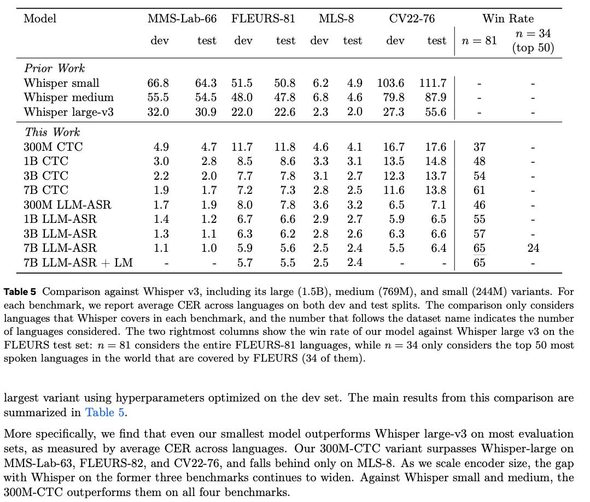

# Image Description

**File:** img_1763034818_AgACAgIA.jpg
**Original:** image.jpg
**Received:** 1763034818

## Extracted Text (OCR)

{
  "from_cache": false,
  "document_key": "f783104b55db58b662ded580411f1498",
  "markdown": "|                                                          | Model  MMS-Lab-66 PLEURS-&1  MLS-&  CV 22-76  Win Rate   | Model  MMS-Lab-66 PLEURS-&1  MLS-&  CV 22-76  Win Rate   |\n|----------------------------------------------------------|----------------------------------------------------------|----------------------------------------------------------|\n|                                                          |                                                          | dev  test dev test dev test dev test  n—sk&l (top 50)    |\n| Whisper small 66.8 64.3 515 50.8 6.2 49 103.6 111.7 |    |                                                          |                                                          |\n| Whisper medium 55.5 54.0 48.0 47.8 68 46 798 87.9 |      |                                                          |                                                          |\n| Whisper large-v3 32.0 30.9 22.0 226 2.3 40 27.3 65.6 |   |                                                          |                                                          |\n| 300M СТС 49 4.7 Пт 11° 46 41 #21607 1761 37              |                                                          |                                                          |\n| 1B CTC  3.0  oR  ROS  8.6  33  4.1  13.5  14.8 |  Ады    |                                                          |                                                          |\n| 3B CTC  29  0)  ТТ  7.5  4.1  от  12.3  13.7 |  54       |                                                          |                                                          |\n| \"В CTC  1.9  1.7  то  7.3  2 Я  2  116  13.8 |  6]       |                                                          |                                                          |\n| S00M LLM-ASR,  1.7  1.9  80  7.5  3.6  Зо  6.5  1 |  46  |                                                          |                                                          |\n| 1B LLM-ASR.  1.4  1.2  6.7  6.6  2 9  27  5.9  6.5 |  55 |                                                          |                                                          |\n| ЗВ LLM-ASR  1.3  1.1  6.3  6.2  5  2.6  6.3  6.6 |  57   |                                                          |                                                          |\n| 1.1  1.0  59  5.6  2)  24  5.5  6.4 |  65  A             |                                                          |                                                          |\n| 7B LLM-ASR + LM  A 7  55  26  65                         |                                                          |                                                          |\n\nTable 5 Comparison against Whisper v3, including its large (1.5B), medium (769M), and small (244M) variants. For each benchmark, we report average CER across languages on both dev and test splits. Lhe comparison only considers languages that Whisper covers ш each benchmark, and the number that follows the dataset name Indicates the number of languages considered. [lhe two rightmost columns show the win rate of our model against Whisper large v3 on the ВЕН ОВ test set: п = 81 considers the entire FLEUHS-&amp;S1 languages, while п = 34 only considers the top 50 most spoken languages in the world that are covered by FLEURS (34 of them).\n\nlargest variant using hyperparameters optimized on the dev set. Ihe main results from this comparison are syimmarized in 'lable 5\n\nMore specifically, we find that even our smallest model outperforms Whisper large-v3 on most evaluation sets, aS measured by average СЕВ. across languages. Our 300M-CTC variant surpasses Whisper-large on MMs-Lab-63, FLEURS-82, and CV22-76, and falls behind only on MLS-8. As we scale encoder size, the gap with Whisper on the former three benchmarks continues to widen. Against Whisper small and medium, the S00M-CTC outperforms them on all four benchmarks.",
  "export_format": "markdown"
}

## Usage Instructions

When referencing this image in markdown:
1. Use relative path based on file location
2. Add descriptive alt text based on OCR content above
3. Add text description BELOW the image for GitHub rendering

Example:
```markdown
 <!-- TODO: Broken image path -->

**Image shows:** [Describe what the image contains based on OCR]
```
