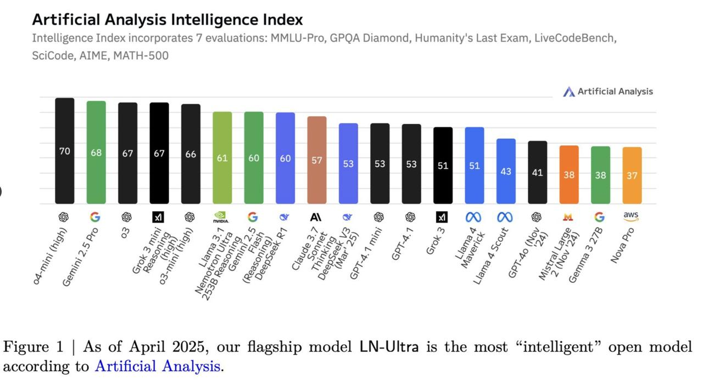

# Image Description

**File:** img_1763100919_AgACAgIA.jpg
**Original:** image.jpg
**Received:** 1763100919

## Extracted Text (OCR)

{
  "from_cache": false,
  "document_key": "898aa635e661343453d9cd4a66db3460",
  "markdown": "## Artificial Analysis Intelligence Index\n\nIntelligence Index incorporates 7 evaluations: MMLU-Pro, GPOA Diamond, Humanity $ Last Exam, LiveCodeBench, SciCode, AIME, MATH-500\n\n<!-- image -->\n\nFigure 1 | As of April 2025, our flagship model LN-Ultra is the most \"intelligent\" open model according to Artificial Analysis.",
  "export_format": "markdown"
}

## Usage Instructions

When referencing this image in markdown:
1. Use relative path based on file location
2. Add descriptive alt text based on OCR content above
3. Add text description BELOW the image for GitHub rendering

Example:
```markdown
 <!-- TODO: Broken image path -->

**Image shows:** [Describe what the image contains based on OCR]
```
