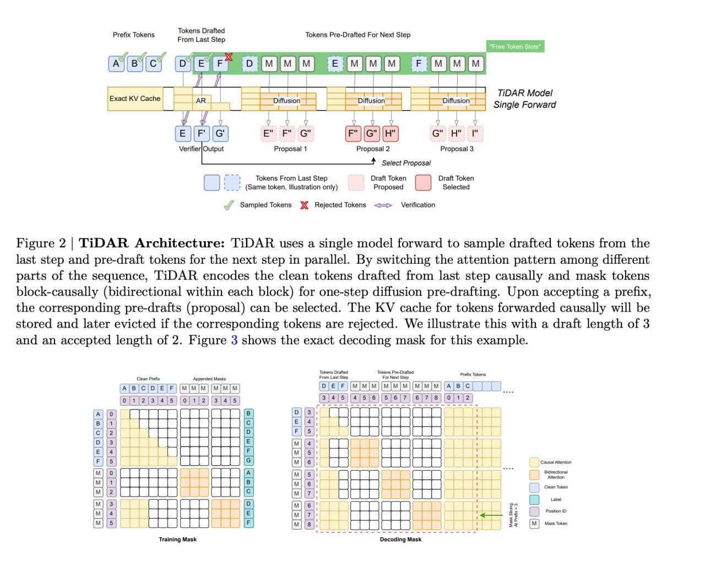

# Image Description

**File:** img_1763108950_AgACAgIA.jpg
**Original:** image.jpg
**Received:** 1763108950

## Extracted Text (OCR)

{
  "from_cache": false,
  "document_key": "22a1f65137fe56ccee996a54409fb608",
  "markdown": "<!-- image -->\n\nFigure 2 | TiDAR Architecture: TiDAR uses a single model forward to sample drafted tokens from the last step and pre-draft tokens for the next step in parallel. By switching the attention pattern among different parts of the sequence, TiDAR encodes the clean tokens drafted from last step causally and mask tokens block-causally (bidirectional within each block) for one-step diffusion pre-drafting. Upon accepting a prefix, the corresponding pre-drafts (proposal) can be selected. The KV cache for tokens forwarded causally will be stored and later evicted if the corresponding tokens are rejected. We illustrate this with a draft length of 3 and an accepted length of 2. Figure 3 shows the exact decoding mask for this example.\n\n<!-- image -->",
  "export_format": "markdown"
}

## Usage Instructions

When referencing this image in markdown:
1. Use relative path based on file location
2. Add descriptive alt text based on OCR content above
3. Add text description BELOW the image for GitHub rendering

Example:
```markdown
 <!-- TODO: Broken image path -->

**Image shows:** [Describe what the image contains based on OCR]
```
