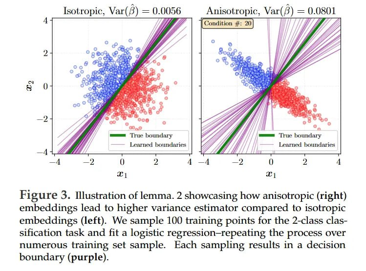

# Image Description

**File:** img_1763178194_AgACAgIA.jpg
**Original:** image.jpg
**Received:** 1763178194

## Extracted Text (OCR)

Figure 3. MIlustration of lemma. 2 showcasing how anisotropic (right) embeddings lead to higher variance estimator compared to isotropic embeddings (left). We sample 100 training points for the 2-class classification task and fit a logistic regression—repeating the process over numerous training set sample. Each sampling results in a decision boundary (purple).

<!-- image -->

## Usage Instructions

When referencing this image in markdown:
1. Use relative path based on file location
2. Add descriptive alt text based on OCR content above
3. Add text description BELOW the image for GitHub rendering

Example:
```markdown
 <!-- TODO: Broken image path -->

**Image shows:** [Describe what the image contains based on OCR]
```
