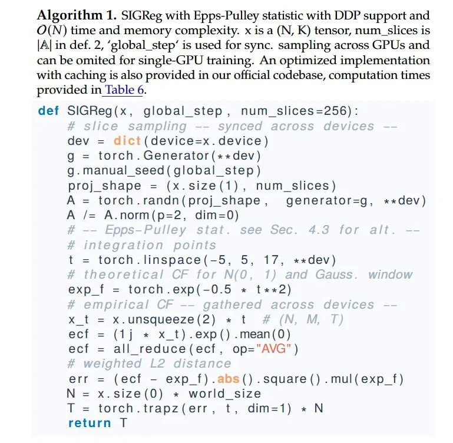

# Image Description

**File:** img_1763179087_AgACAgIA.jpg
**Original:** image.jpg
**Received:** 1763179087

## Extracted Text (OCR)

Algorithm 1. SIGReg with Epps-Pulley statistic with DDP support and O(N) time and memory complexity. x is a (М, K) tensor, num\_slices is А] in def. 2, "global\_step' is used for sync. sampling across GPUs and can be omited for single-GPU training. An optimized implementation with caching is also provided in our official codebase, computation times provided in lable 6.

```
def SiGReg(x, global step, num_slices=256): Чеу = dict(aevice=x.aevice) Ч = torch. Generator(++«dev) g.manual seea(giobdal step) proj shape = (x.size(1), num_slices) А = torch.randn(proj shape, generator=g, «*sdev) А /= A.norm(p=2, dim=0) t = torch.linspace(-5, 5, 17, *«dev) exp + = torch.exp(-0.5 « 1х2] Xf = х.ипзацееге{2} « | ecf = (1j * x_t).exp() .mean(0Q) ес! = all _reduce(ecf, op="AVG") err = (ect - exp _f).aos().square().mul(exp f) N= x.size(0O) * world_ size Т = torcn.trapz(err, t, aim=1) «* № return |
```

## Usage Instructions

When referencing this image in markdown:
1. Use relative path based on file location
2. Add descriptive alt text based on OCR content above
3. Add text description BELOW the image for GitHub rendering

Example:
```markdown
 <!-- TODO: Broken image path -->

**Image shows:** [Describe what the image contains based on OCR]
```
