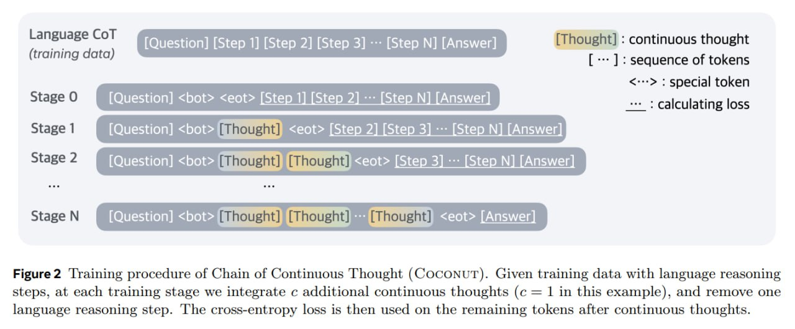

# Image Description

**File:** img_1763209042_AgACAgIA.jpg
**Original:** image.jpg
**Received:** 1763209042

## Extracted Text (OCR)

<!-- image -->

Figure 2 Training procedure of Chain of Continuous Thought (COCONUT). Given training data with language reasoning steps, at each training stage we integrate c additional continuous thoughts (c = 1 in this example), and remove one language reasoning step. lhe cross-entropy loss is then used on the remaining tokens after continuous thoughts.

## Usage Instructions

When referencing this image in markdown:
1. Use relative path based on file location
2. Add descriptive alt text based on OCR content above
3. Add text description BELOW the image for GitHub rendering

Example:
```markdown
 <!-- TODO: Broken image path -->

**Image shows:** [Describe what the image contains based on OCR]
```
