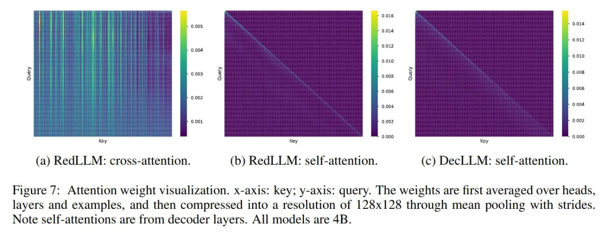

# Image Description

**File:** img_1763345889_aqadbgtrgyih2eh_from_cache_false_document_key_1501952f8c.jpg
**Original:** image.jpg
**Received:** 1763345889

## Extracted Text (OCR)

(a) Redi\_LLM: cross-attention. (b) RedLLM: self-attention. (с) DecLLM: selt-attention.

<!-- image -->

Figure 7: Attention weight visualization. x-axis: key; y-axis: query. The weights are first averaged over heads. layers and examples, and then compressed into a resolution of 128x128 through mean pooling with strides. Note self-attentions are from decoder layers. All models are 4B.

## Usage Instructions

When referencing this image in markdown:
1. Use relative path based on file location
2. Add descriptive alt text based on OCR content above
3. Add text description BELOW the image for GitHub rendering

Example:
```markdown
 <!-- TODO: Broken image path -->

**Image shows:** [Describe what the image contains based on OCR]
```
