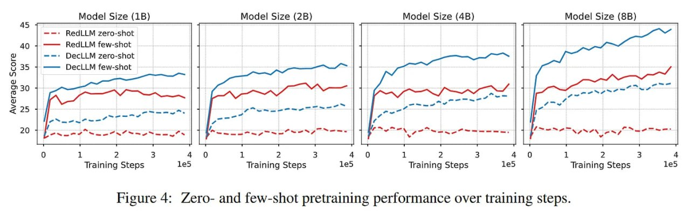

# Image Description

**File:** img_1763345889_aqadkxfrgyih0eh_from_cache_false_document_key_ce7209e155.jpg
**Original:** image.jpg
**Received:** 1763345889

## Extracted Text (OCR)

Figure 4: Zero- and few-shot pretraining performance over training steps.

<!-- image -->

## Usage Instructions

When referencing this image in markdown:
1. Use relative path based on file location
2. Add descriptive alt text based on OCR content above
3. Add text description BELOW the image for GitHub rendering

Example:
```markdown
 <!-- TODO: Broken image path -->

**Image shows:** [Describe what the image contains based on OCR]
```
