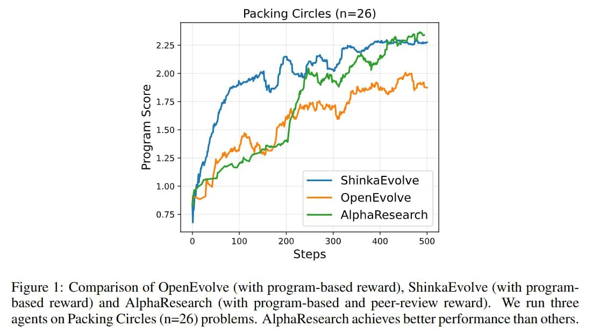

# Image Description

**File:** img_1763352311_aqadihjrg6oayeh_from_cache_false_document_key_6f3b645f9e.jpg
**Original:** image.jpg
**Received:** 1763352311

## Extracted Text (OCR)

Figure |: Comparison of OpenEvolve (with program-based reward), ShinkaEvolve (with programbased reward) and AlphaKesearch (with program-based and peer-review reward). We run three agents on Packing Circles (n=26) problems. AlphaKesearch achieves better performance than others.

<!-- image -->

## Usage Instructions

When referencing this image in markdown:
1. Use relative path based on file location
2. Add descriptive alt text based on OCR content above
3. Add text description BELOW the image for GitHub rendering

Example:
```markdown
 <!-- TODO: Broken image path -->

**Image shows:** [Describe what the image contains based on OCR]
```
