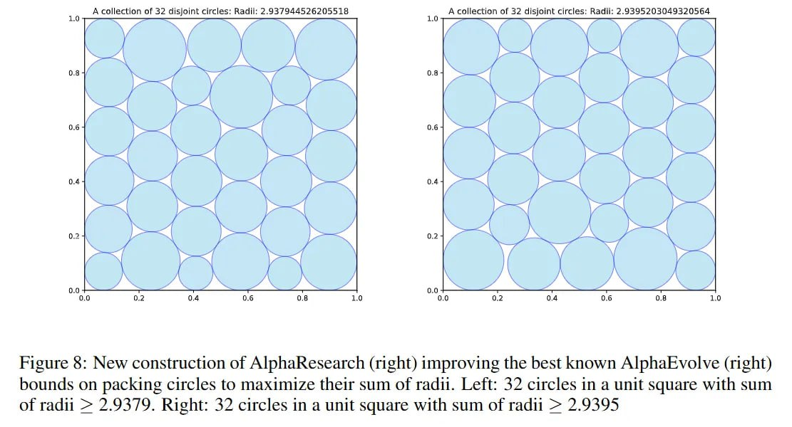

# Image Description

**File:** img_1763352311_aqadirjrg6oayeh_from_cache_false_document_key_157f36a9b9.jpg
**Original:** image.jpg
**Received:** 1763352311

## Extracted Text (OCR)

Figure 6: New construction of AlphaResearch (right) improving the best known Alphakvolve (right) bounds on packing circles to maximize their sum of radi. Left: 52 circles in a unit square with sum of radu &gt; 2.9379. Right: 32 circles in a unit square with sum of radi &gt; 2.9395

<!-- image -->

## Usage Instructions

When referencing this image in markdown:
1. Use relative path based on file location
2. Add descriptive alt text based on OCR content above
3. Add text description BELOW the image for GitHub rendering

Example:
```markdown
 <!-- TODO: Broken image path -->

**Image shows:** [Describe what the image contains based on OCR]
```
