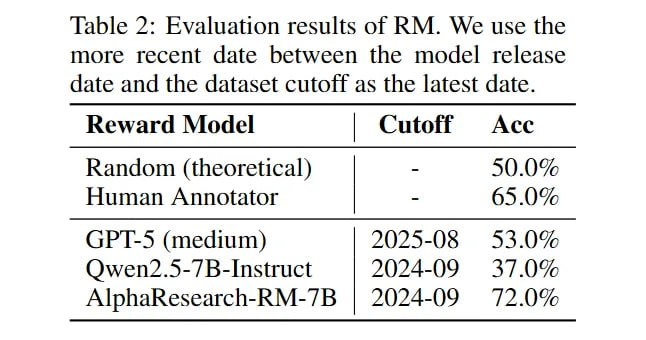

# Image Description

**File:** img_1763352311_aqadixjrg6oayeh9_from_cache_false_document_key_212d3d5dcd.jpg
**Original:** image.jpg
**Received:** 1763352311

## Extracted Text (OCR)

'Table 2: Evaluation results of RM. We use the more recent date hetween the model release date and the dataset cutott as the latest date.

| Reward  Mio  del                               |
|------------------------------------------------|
| Random (theoretical) | - 50.0% Human Annotator |
| GP I-S (medium) | 2025-08 53.0%                |
| Owen2.5-/B-Instruct | 2024-09 37.0%            |
| AlphaResearch-RM-/B | 2024-09 120%             |

## Usage Instructions

When referencing this image in markdown:
1. Use relative path based on file location
2. Add descriptive alt text based on OCR content above
3. Add text description BELOW the image for GitHub rendering

Example:
```markdown
 <!-- TODO: Broken image path -->

**Image shows:** [Describe what the image contains based on OCR]
```
