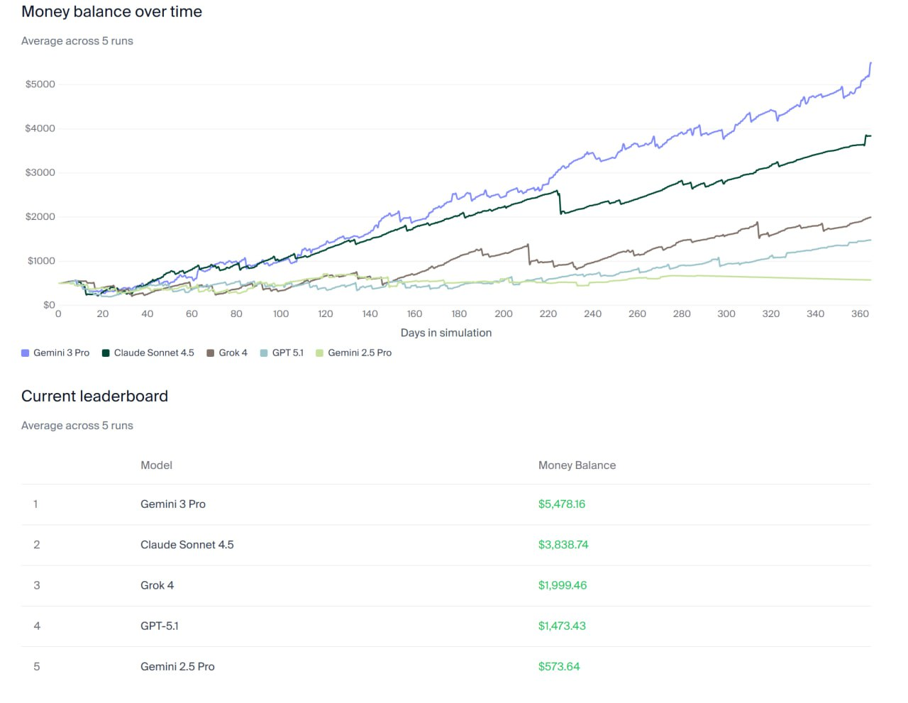

# Image Description

**File:** img_1763528339_aqadrhjrg7bw4uh_dalance_over_time_average.jpg
**Original:** image.jpg
**Received:** 1763528339

## Extracted Text (OCR)

## Мопеу Dalance over time

Average across 3 runs

<!-- image -->

## Current leaderboard

Average across 5 runs

| Viodel Vioney balance       |
|-----------------------------|
| Gemini 3 Pro $5,4/6.16      |
| Claude Sonnet 4.5 $3,838.74 |
| Grok 4 $1,999.46            |
| СРТ-51 $1473.83             |
| Gemini 2.5 Pro $573.64      |

## Usage Instructions

When referencing this image in markdown:
1. Use relative path based on file location
2. Add descriptive alt text based on OCR content above
3. Add text description BELOW the image for GitHub rendering

Example:
```markdown
 <!-- TODO: Broken image path -->

**Image shows:** [Describe what the image contains based on OCR]
```
