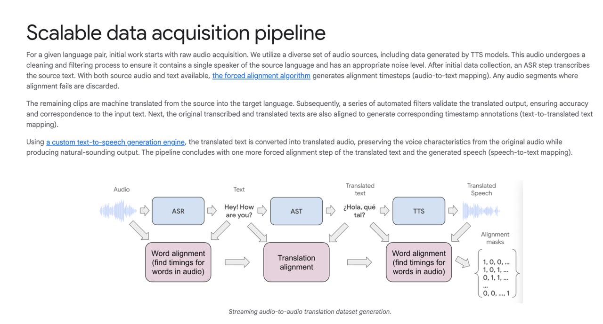

# Image Description

**File:** img_1763641211_aqadwg5rg0wl8uh_scalable_data_acquisition_pipeline_for.jpg
**Original:** image.jpg
**Received:** 1763641211

## Extracted Text (OCR)

## scalable data acquisition pipeline

For a given language pair, initial work starts with raw audio acquisition, We utilize a diverse set of audio sources, including data generated by TTS models. This audio undergoes a cleaning and nitering process to ensure It contains a single speaker of the source language ana has an appropriate noise level. After initial data collection, an ASR step transcribes the source text. With both source audio and text available, the forced alignment algorithm generates alignment timesteps (audio-to-text mapping). Any audio segments where alignment fails are discarded.

The remaining clips are machine translated from the source into the target language. Subsequently, a series of automated filters validate the translated output, ensuring accuracy and correspondence to the input text. Next, the original transcribed and translated texts are aiso aliqned to generate corresponding timestamp annotations (text-to-translated text mapping).

Using a custom text-to-speech generation engine, tne translated text is converted into translated audio, preserving the voice characteristics from the original audio wnile producing natural-sounding output. The pipeline concludes with one more torced alignment step of the translated text and the generated speech (speech-to-text mapping).

<!-- image -->

## Usage Instructions

When referencing this image in markdown:
1. Use relative path based on file location
2. Add descriptive alt text based on OCR content above
3. Add text description BELOW the image for GitHub rendering

Example:
```markdown
 <!-- TODO: Broken image path -->

**Image shows:** [Describe what the image contains based on OCR]
```
