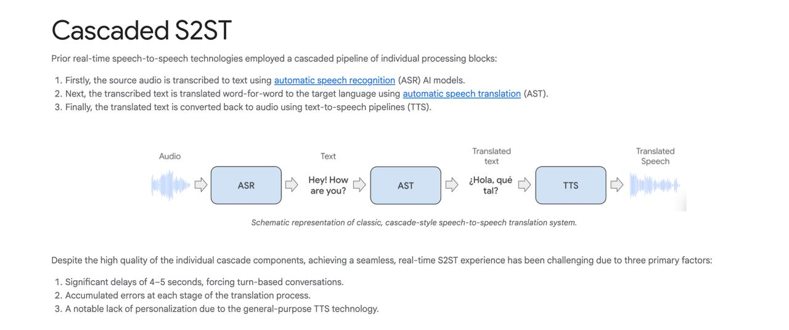

# Image Description

**File:** img_1763641211_aqadww5rg0wl8uh_cascaded_s2st_prior_real_time_speecn_to_.jpg
**Original:** image.jpg
**Received:** 1763641211

## Extracted Text (OCR)

## Cascaded S2ST

Prior real-time speecn-to-speech tecnnologies employed a cascaded pipeline of individual processing DIocks:

1. Firstly, the source audio 15 transcribed to text using automatic speech recognition (ASR) Al models.
2. Next, the transcribed text is translated word-tor-word to the target language using automatic speech translation (AST).
3. Finally, the translated text is converted back to audio using text-to-speech pipelines (TTS).

<!-- image -->

Schematic representation of classic, cascade-style speech-to-speech translation system.

Despite the nigh quality of the individual Cascade components, achieving a seamless, real-time 525Т experience nas been challenging due to three primary factors:

1. Significant delays of 4—5 seconds, forcing turn-based conversations.
2. Accumulated errors at each stage of the translation process.
3. А notable lack of personalization due to the general-purpose TTS tecnnology.

## Usage Instructions

When referencing this image in markdown:
1. Use relative path based on file location
2. Add descriptive alt text based on OCR content above
3. Add text description BELOW the image for GitHub rendering

Example:
```markdown
 <!-- TODO: Broken image path -->

**Image shows:** [Describe what the image contains based on OCR]
```
