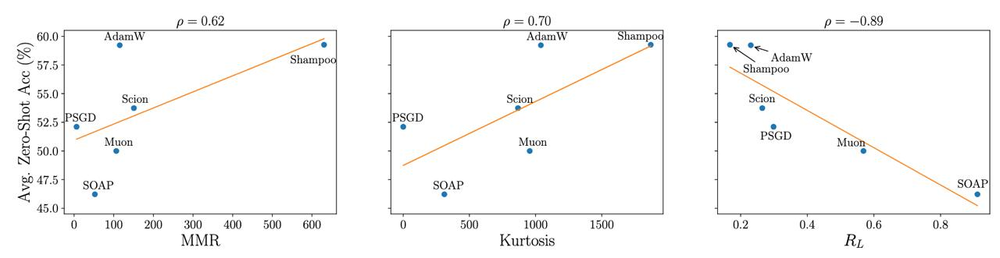

# Image Description

**File:** img_1763644633_aqadhrbrg6f36eh_94_dd_jouc_o197_sav_95_0.jpg
**Original:** image.jpg
**Received:** 1763644633

## Extracted Text (OCR)

(94) DD JOUC-O197 “SAV

95.0

р = 0.62

310) 400

600)

p= 0.70

1000

Kurtosis

Lat)

## Usage Instructions

When referencing this image in markdown:
1. Use relative path based on file location
2. Add descriptive alt text based on OCR content above
3. Add text description BELOW the image for GitHub rendering

Example:
```markdown
 <!-- TODO: Broken image path -->

**Image shows:** [Describe what the image contains based on OCR]
```
