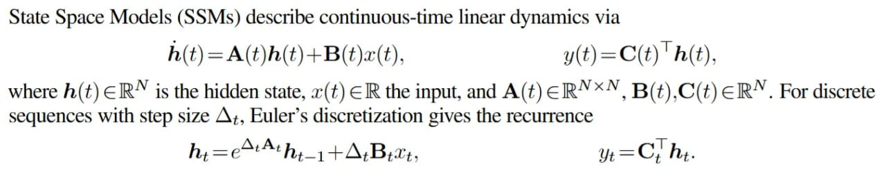

# Image Description

**File:** img_1763823137_aqadgatrgwrcel_state_space_models_ssms_describe_continu.jpg
**Original:** image.jpg
**Received:** 1763823137

## Extracted Text (OCR)

State Space Models (SSMs) describe continuous-time linear dynamics via

<!-- formula-not-decoded -->

where h(t) Е В^ is the hidden state, a(t) ЕВ the input, and A(t) Е В^Х", B(t),C(t) ЕВА. For discrete sequences with step size А+, Euler's discretization gives the recurrence

<!-- formula-not-decoded -->

## Usage Instructions

When referencing this image in markdown:
1. Use relative path based on file location
2. Add descriptive alt text based on OCR content above
3. Add text description BELOW the image for GitHub rendering

Example:
```markdown
 <!-- TODO: Broken image path -->

**Image shows:** [Describe what the image contains based on OCR]
```
