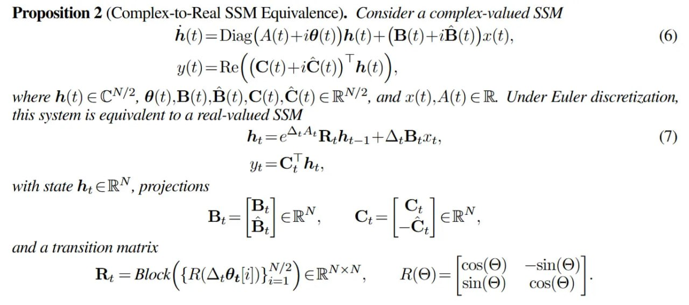

# Image Description

**File:** img_1763823137_aqadggtrgwrcel_proposition_2_complex_to_real_ssm_equiva.jpg
**Original:** image.jpg
**Received:** 1763823137

## Extracted Text (OCR)

Proposition 2 (Complex-to-Real SSM Equivalence). Consider a complex-valued SSM

<!-- formula-not-decoded -->

where h(t) € C'/?, @(t),B(t),B(t),C(t),C(t) € RX/2, and x(t), A(t) ЕВ. Under Euler discretization, this system is equivalent to a real-valued SSM

<!-- formula-not-decoded -->

with state hy; Е ВА, projections

and a transition matrix

<!-- formula-not-decoded -->

## Usage Instructions

When referencing this image in markdown:
1. Use relative path based on file location
2. Add descriptive alt text based on OCR content above
3. Add text description BELOW the image for GitHub rendering

Example:
```markdown
 <!-- TODO: Broken image path -->

**Image shows:** [Describe what the image contains based on OCR]
```
