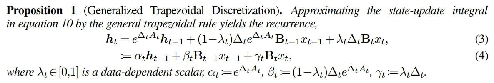

# Image Description

**File:** img_1763823137_aqadgqtrgwrcel_proposition_1_generalized_trapezoidal_di.jpg
**Original:** image.jpg
**Received:** 1763823137

## Extracted Text (OCR)

Proposition 1 (Generalized Trapezoidal Discretization). Approximating the state-update integral in equation 10 by the general trapezoidal rule yields the recurrence,

<!-- formula-not-decoded -->

where №, Е 01| is a data-dependent scalar, ох = Аа, В, = (1-^,)А, Ач, гу, = Л, А,

## Usage Instructions

When referencing this image in markdown:
1. Use relative path based on file location
2. Add descriptive alt text based on OCR content above
3. Add text description BELOW the image for GitHub rendering

Example:
```markdown
 <!-- TODO: Broken image path -->

**Image shows:** [Describe what the image contains based on OCR]
```
