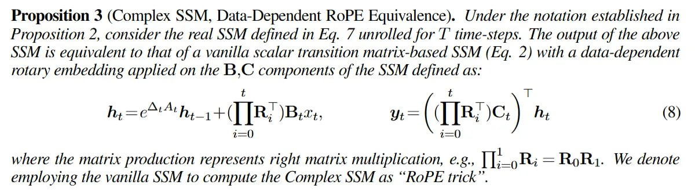

# Image Description

**File:** img_1763823137_aqadgwtrgwrcel_proposition_3_complex_ssm_data_dependent.jpg
**Original:** image.jpg
**Received:** 1763823137

## Extracted Text (OCR)

Proposition 3 (Complex SSM, Data-Dependent RoPE Equivalence). Under the notation established in Proposition 2, consider the real SSM defined in Eq. / unrolled for Е time-steps. The output of the above SSM is equivalent to that of a vanilla scalar transition matrix-based SSM (Eq. 2) with a data-dependent rotary embedding applied on the B,C components of the SSM defined as:

<!-- formula-not-decoded -->

where the matrix production represents right matrix multiplication, e.g., ||; ~~.» В; = RoR. We denote employing the vanilla SSM to compute the Complex SSM as "RoPE trick

## Usage Instructions

When referencing this image in markdown:
1. Use relative path based on file location
2. Add descriptive alt text based on OCR content above
3. Add text description BELOW the image for GitHub rendering

Example:
```markdown
 <!-- TODO: Broken image path -->

**Image shows:** [Describe what the image contains based on OCR]
```
