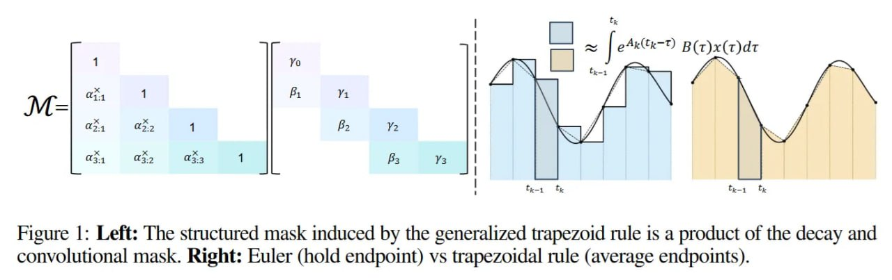

# Image Description

**File:** img_1763823137_aqadhatrgwrcel_figure_left_the_structured_mask.jpg
**Original:** image.jpg
**Received:** 1763823137

## Extracted Text (OCR)

Figure |: Left: The structured mask induced by the generalized trapezoid rule is a product of the decay and convolutional mask. Right: Euler (hold endpoint) vs trapezoidal rule (average endpoints).

<!-- image -->

## Usage Instructions

When referencing this image in markdown:
1. Use relative path based on file location
2. Add descriptive alt text based on OCR content above
3. Add text description BELOW the image for GitHub rendering

Example:
```markdown
 <!-- TODO: Broken image path -->

**Image shows:** [Describe what the image contains based on OCR]
```
