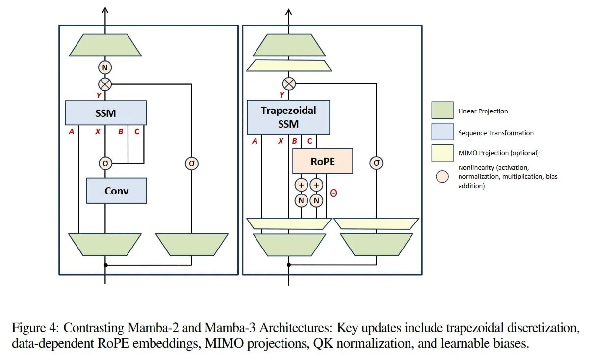

# Image Description

**File:** img_1763823137_aqadhgtrgwrcel_figure_4_contrasting_mamba_2_and_mamba_3.jpg
**Original:** image.jpg
**Received:** 1763823137

## Extracted Text (OCR)

Figure 4: Contrasting Mamba-2 and Mamba-3 Architectures: Key updates include trapezoidal discretization. data-dependent RoPE embeddings, MIMO projections, QK normalization, and learnable biases.

<!-- image -->

## Usage Instructions

When referencing this image in markdown:
1. Use relative path based on file location
2. Add descriptive alt text based on OCR content above
3. Add text description BELOW the image for GitHub rendering

Example:
```markdown
 <!-- TODO: Broken image path -->

**Image shows:** [Describe what the image contains based on OCR]
```
