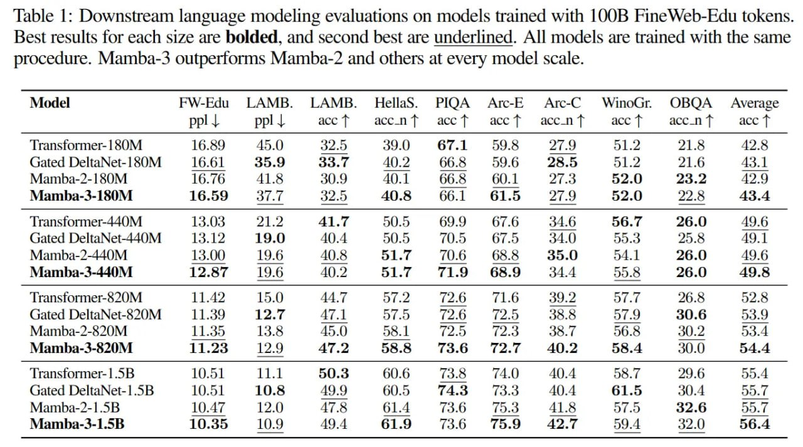

# Image Description

**File:** img_1763823137_aqadhwtrgwrcel_table_1_downstream_language_modeling_eva.jpg
**Original:** image.jpg
**Received:** 1763823137

## Extracted Text (OCR)

Table 1: Downstream language modeling evaluations on models trained with 1008 Fine Web-Edu tokens. Best results for each size are bolded, and second best are underlined. All models are trained with the same procedure. Mamba-3 outperforms Mamba-2 and others at every model scale.

|                                                                                                                                           | Model  FW-Edu  LAMB. LAMB. Hellas. PIQA Arc-E Arc-C WinoGr.  OBQA Average ppl | ppl | acct accent acct acct accnfT acct accnT-— accT   |
|-------------------------------------------------------------------------------------------------------------------------------------------|----------------------------------------------------------------------------------------------------------------------------------------|
| Transformer- 180M 16.89 45.0 32.0 39.0 67.1 959.8 21.9 21.2 21.8 42.8 Gated DeltaNet- 180M 16.61 30.9 33.7 40.2 66.8 959.6 28.5 91.2 21.6 |                                                                                                                                        |
| Mamba-2- 180M 16.76 41.8 30.9 40.1 66.5 60.1 27.3 92.0 23.2 4.2.9                                                                         |                                                                                                                                        |
| Mamba-3-130M 16.59 Г.Г 9.2.0 40.8 66.1 61.5                                                                                               |                                                                                                                                        |
| Transformer-440M 13.03 21.2 41.7 50.5 69.9 67.6 34.6 56.7 26.0                                                                            |                                                                                                                                        |
| (sated DeltaNet-440M 13 12 19.0 404 50.5 7005 67.5 340) 553 25 © 49]                                                                      |                                                                                                                                        |
| Mamba-2-440M 13.00 19.6 AQ).8 51.7 70.6 08.8 30.0 24.1 26.0                                                                               |                                                                                                                                        |
| 440M 12.87 — 19.6 40.2 91.7 71.9 689 344 25.  26.0 49.8  ел OO                                                                            |                                                                                                                                        |
| Transformer-820M 11.42 15.0 44,7 97.2 72.6 7106 99.2 Э.Р 20.8 52.8                                                                        |                                                                                                                                        |
| Gated DeltaNet-820M 11.39 12.7 47.1 97.0 726 [2.0 38.8 97.9 30.6 3.9                                                                      |                                                                                                                                        |
| Mamba-2-320M 11.35 13.8 45.0 28.1 12.0 12.9 JO. Г 96.8 30.2 03.4                                                                          |                                                                                                                                        |
| 11.33  13.9  47.2  ASS  73.6 2.7  40.2  58.4  40.0  54.4                                                                                  |                                                                                                                                        |
| Transformer-!.5B 10.51 11.1 50.3 60.6 13.8 74.0 40.4 8.7 29.6 99.4                                                                        |                                                                                                                                        |
| Gated DeltaNet-1.5B 10.51 10.8 49.9 60.2 74.35 73.3 40.4 61.5 30.4  on                                                                    |                                                                                                                                        |
| Mamba-2-1.5B  АГ  12.0  41.5  9Г.0  32.6                                                                                                  |                                                                                                                                        |
| 3-LSB  10.35  49.4  61.9  13.6  19.9  42.7  56.4                                                                                          |                                                                                                                                        |

## Usage Instructions

When referencing this image in markdown:
1. Use relative path based on file location
2. Add descriptive alt text based on OCR content above
3. Add text description BELOW the image for GitHub rendering

Example:
```markdown
 <!-- TODO: Broken image path -->

**Image shows:** [Describe what the image contains based on OCR]
```
