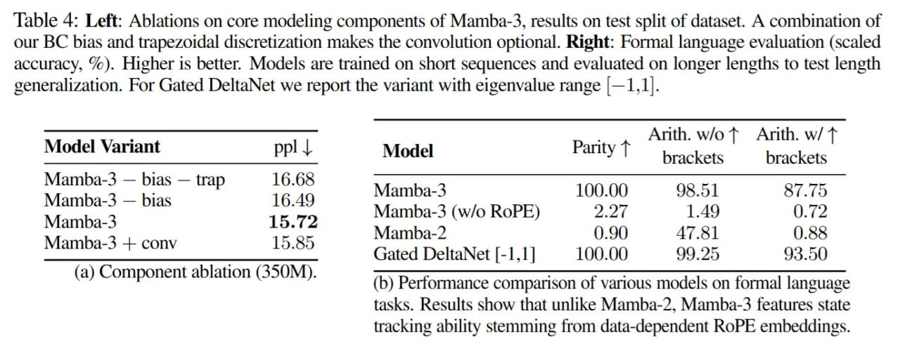

# Image Description

**File:** img_1763823137_aqadiatrgwrcel_table_4_left_ablations_on_core.jpg
**Original:** image.jpg
**Received:** 1763823137

## Extracted Text (OCR)

Table 4: Left: Ablations on core modeling components of Mamba-3, results on test split of dataset. A combination of our BC bias and trapezoidal discretization makes the convolution optional. Right: Formal language evaluation (scaled accuracy, %). Higher 1s better. Models are trained on short sequences and evaluated on longer lengths to test length generalization. For Gated DeltaNet we report the variant with eigenvalue range |—1,1).

Arith. w/o Т Ап. w/ 1

| eee Seer a | Spee eee Spek

Model Variant ppl | Model Parity 7

Mamba-3 — bias — trap 16.68 4,4 °° ann io бек
Mamba-3 — bias 1644  Mamba3 1000 98.51 87.75

Mamba-3 15.72 ИК

Л...

ih

ПАО Gated DeltaNet [-1,1] 100.00 99.25 93.5

(а) Сотропет абаноп (350М). (b) Performance comparison of various models on formal language tasks. Results show that unlike Mamba-2. Mamba-3 features state tracking ability stemming from data-dependent RoPE embeddings.

|                                       | brackets brackets   |
|---------------------------------------|---------------------|
| Pte Mamba-3 (w/o RoPE) 2.27 1.49 0.72 |                     |

## Usage Instructions

When referencing this image in markdown:
1. Use relative path based on file location
2. Add descriptive alt text based on OCR content above
3. Add text description BELOW the image for GitHub rendering

Example:
```markdown
 <!-- TODO: Broken image path -->

**Image shows:** [Describe what the image contains based on OCR]
```
