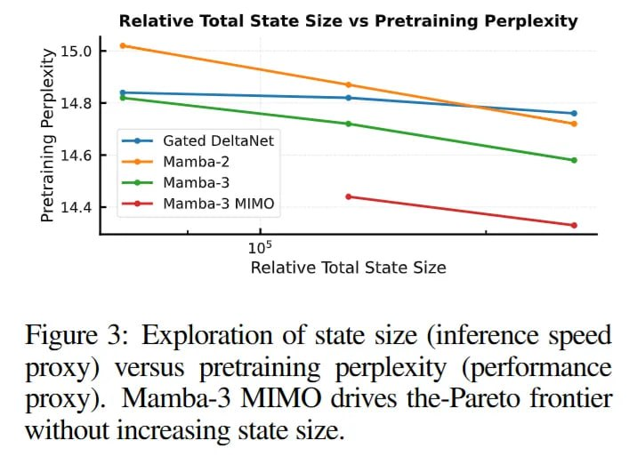

# Image Description

**File:** img_1763823137_aqadiqtrgwrcel9_image_figure_3_exploration.jpg
**Original:** image.jpg
**Received:** 1763823137

## Extracted Text (OCR)

<!-- image -->

Figure 3: Exploration of state size (inference speed proxy) versus pretraining perplexity (performance proxy). Mamba-3 MIMO drives the-Pareto frontier without increasing state size.

## Usage Instructions

When referencing this image in markdown:
1. Use relative path based on file location
2. Add descriptive alt text based on OCR content above
3. Add text description BELOW the image for GitHub rendering

Example:
```markdown
 <!-- TODO: Broken image path -->

**Image shows:** [Describe what the image contains based on OCR]
```
