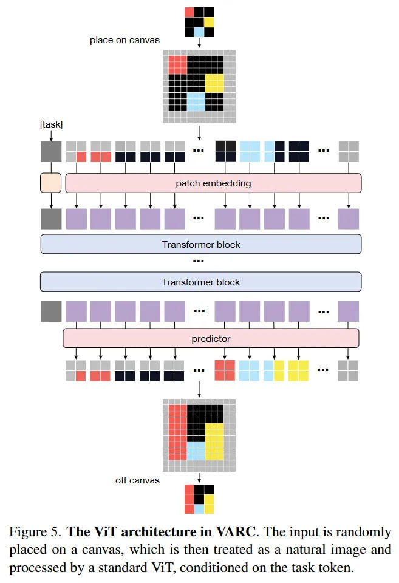

# Image Description

**File:** img_1764033898_aqadow9rg9mngul_ficure_5_the_architecture_in.jpg
**Original:** image.jpg
**Received:** 1764033898

## Extracted Text (OCR)

Ficure 5. The МТ architecture in VARC. The input is randomly placed on a canvas, which is then treated as a natural image and processed by a standard \11, conditioned on the task token.

<!-- image -->

## Usage Instructions

When referencing this image in markdown:
1. Use relative path based on file location
2. Add descriptive alt text based on OCR content above
3. Add text description BELOW the image for GitHub rendering

Example:
```markdown
 <!-- TODO: Broken image path -->

**Image shows:** [Describe what the image contains based on OCR]
```
