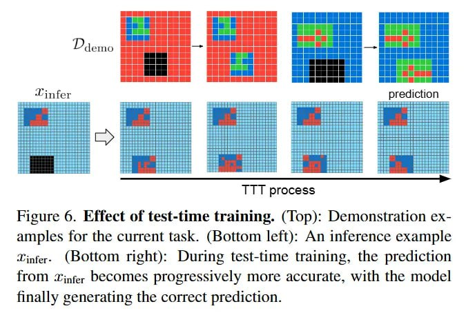

# Image Description

**File:** img_1764033898_aqadpa9rg9mngul9_figure_6_effect_of_test_time_training.jpg
**Original:** image.jpg
**Received:** 1764033898

## Extracted Text (OCR)

Figure 6. Effect of test-time training. (Top): Demonstration examples for the current task. (Bottom left): An inference example infers (bottom right): During test-time training, the prediction Гот infer DecoMmes progressively more accurate, with the model finally generating the correct prediction.

<!-- image -->

## Usage Instructions

When referencing this image in markdown:
1. Use relative path based on file location
2. Add descriptive alt text based on OCR content above
3. Add text description BELOW the image for GitHub rendering

Example:
```markdown
 <!-- TODO: Broken image path -->

**Image shows:** [Describe what the image contains based on OCR]
```
