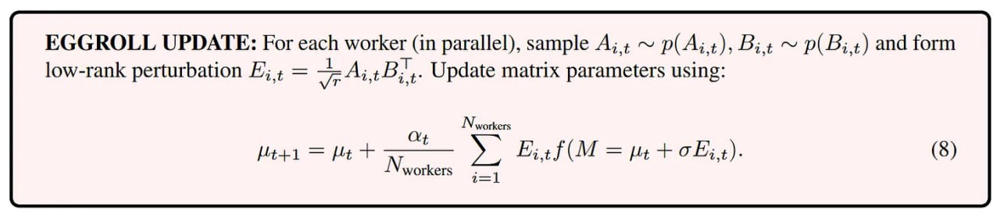

# Image Description

**File:** img_1764033927_aqadmgtrgw9rkel_eggroll_update_for_each_worker_in.jpg
**Original:** image.jpg
**Received:** 1764033927

## Extracted Text (OCR)

EGGROLL UPDATE: For each worker (in parallel), sample A; + ~ p( A; +), Ву + ~ p( 6:4) and form low-rank perturbation Е; + = = АВ; 1. Update matrix parameters using:

<!-- formula-not-decoded -->

## Usage Instructions

When referencing this image in markdown:
1. Use relative path based on file location
2. Add descriptive alt text based on OCR content above
3. Add text description BELOW the image for GitHub rendering

Example:
```markdown
 <!-- TODO: Broken image path -->

**Image shows:** [Describe what the image contains based on OCR]
```
