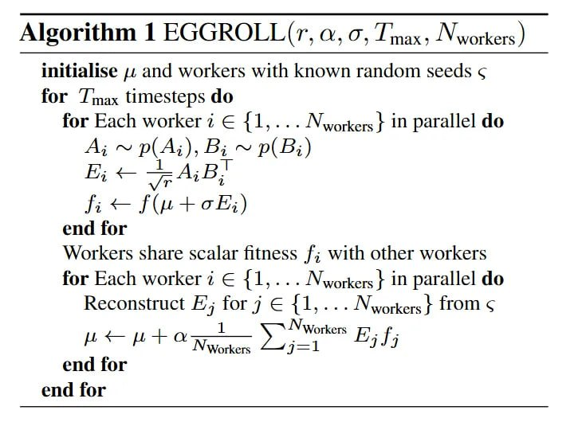

# Image Description

**File:** img_1764033927_aqadmqtrgw9rkel9_algorithm_1_eggroll_r_a.jpg
**Original:** image.jpg
**Received:** 1764033927

## Extracted Text (OCR)

## Algorithm 1 EGGROLL(r, a, д, Tnax, Nworkers)

Initialise д and workers with known random seeds © for J max timesteps do

<!-- formula-not-decoded -->

<!-- formula-not-decoded -->

## end tor

Workers share scalar fitness {; with other workers for Each worker + © {1,...Nworkers } 1n parallel do Reconstruct №; for 7 Е {1,... Nworkers f from $

<!-- formula-not-decoded -->

## Usage Instructions

When referencing this image in markdown:
1. Use relative path based on file location
2. Add descriptive alt text based on OCR content above
3. Add text description BELOW the image for GitHub rendering

Example:
```markdown
 <!-- TODO: Broken image path -->

**Image shows:** [Describe what the image contains based on OCR]
```
