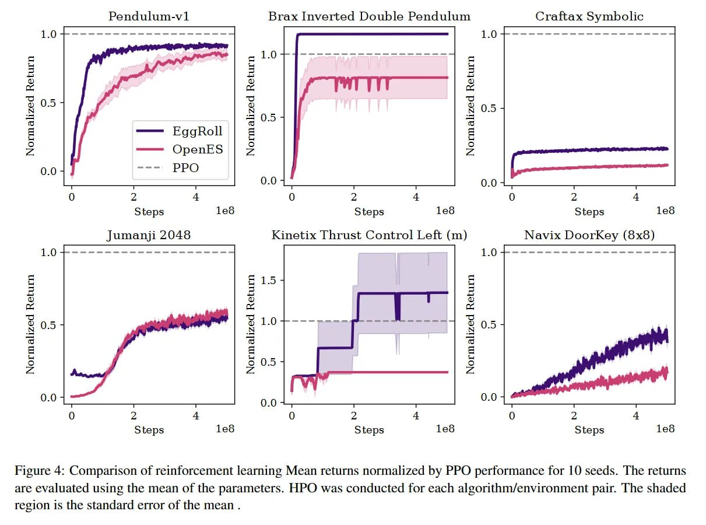

# Image Description

**File:** img_1764033927_aqadmwtrgw9rkel_figure_4_comparison_of_reinforcement_lea.jpg
**Original:** image.jpg
**Received:** 1764033927

## Extracted Text (OCR)

Figure 4: Comparison of reinforcement learning Mean returns normalized by PPO performance for 10 seeds. Ihe returns are evaluated using the mean of the parameters. HPO was conducted for each algorithm/environment pair. [he shaded region 1$ the standard error of the mean.

<!-- image -->

## Usage Instructions

When referencing this image in markdown:
1. Use relative path based on file location
2. Add descriptive alt text based on OCR content above
3. Add text description BELOW the image for GitHub rendering

Example:
```markdown
 <!-- TODO: Broken image path -->

**Image shows:** [Describe what the image contains based on OCR]
```
