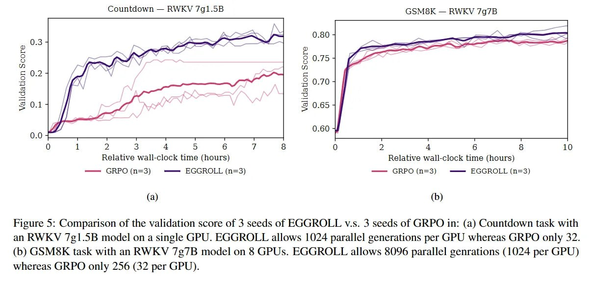

# Image Description

**File:** img_1764033927_aqadnatrgw9rkel_figure_5_comparison_of_the_validation.jpg
**Original:** image.jpg
**Received:** 1764033927

## Extracted Text (OCR)

Figure 5: Comparison of the validation score of 3 seeds of EGGROLL v.s. 3 seeds of GRPO тп: (a) Countdown task with ап RWKYV /¢1.565 model on a single GPU. EGGROLL allows 1024 parallel generations per GPU whereas GRPO only 32. (b) GSMSK task with an RWKYV /2/B model on $ GPUs. EGGROLL allows 8096 parallel genrations (1024 per GPU) whereas GRPO only 256 (32 per GPU).

<!-- image -->

## Usage Instructions

When referencing this image in markdown:
1. Use relative path based on file location
2. Add descriptive alt text based on OCR content above
3. Add text description BELOW the image for GitHub rendering

Example:
```markdown
 <!-- TODO: Broken image path -->

**Image shows:** [Describe what the image contains based on OCR]
```
