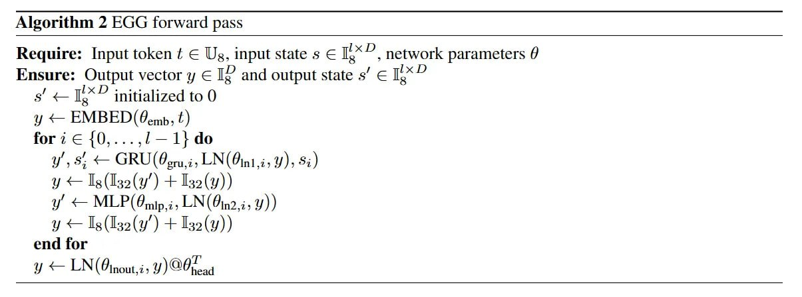

# Image Description

**File:** img_1764033927_aqadnqtrgw9rkel_algorithm_2_egg_forward_pass.jpg
**Original:** image.jpg
**Received:** 1764033927

## Extracted Text (OCR)

## Algorithm 2 EGG forward pass

```
Require: Input token ¢ = Ug, input state s Е LL ‚ network parameters @ Ensure: Output vector у Е IY and output state s' € Feed 5' + I,*" initialized to 0 у < EMBED(@emp, #} for 2 € {0,...,4—1} do у < Ig(Iso(y") + Iseo(y)) у —
М
Г,
Р
(9
mip
i, LN(

In

2 у + Ig(Iso(y") + Isea(y)) end tor у <— LN(@inout, 14 y) QO,
```

## Usage Instructions

When referencing this image in markdown:
1. Use relative path based on file location
2. Add descriptive alt text based on OCR content above
3. Add text description BELOW the image for GitHub rendering

Example:
```markdown
 <!-- TODO: Broken image path -->

**Image shows:** [Describe what the image contains based on OCR]
```
