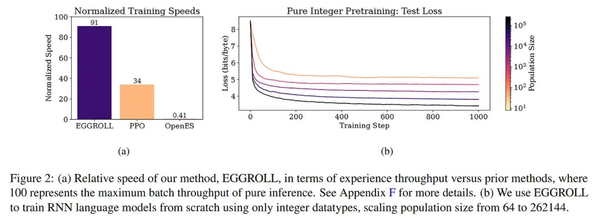

# Image Description

**File:** img_1764033927_aqadnwtrgw9rkel_figure_2_a_relative_speed_of.jpg
**Original:** image.jpg
**Received:** 1764033927

## Extracted Text (OCR)

Figure 2: (a) Relative speed of our method, EGGROLL, in terms of experience throughput versus prior methods, where [00 represents the maximum batch throughput of pure inference. See Appendix Е for more details. (b) We use EGGROLL to train RNN language models from scratch using only integer datatypes, scaling population size from 64 to 262144.

<!-- image -->

## Usage Instructions

When referencing this image in markdown:
1. Use relative path based on file location
2. Add descriptive alt text based on OCR content above
3. Add text description BELOW the image for GitHub rendering

Example:
```markdown
 <!-- TODO: Broken image path -->

**Image shows:** [Describe what the image contains based on OCR]
```
