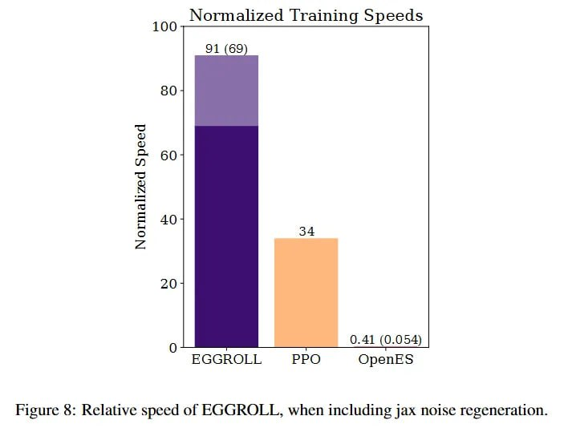

# Image Description

**File:** img_1764033927_aqadoqtrgw9rkel9_figure_6_relative_speed_of_eggroll.jpg
**Original:** image.jpg
**Received:** 1764033927

## Extracted Text (OCR)

Figure 6: Relative speed of EGGROLL, when including jax noise regeneration.

<!-- image -->

## Usage Instructions

When referencing this image in markdown:
1. Use relative path based on file location
2. Add descriptive alt text based on OCR content above
3. Add text description BELOW the image for GitHub rendering

Example:
```markdown
 <!-- TODO: Broken image path -->

**Image shows:** [Describe what the image contains based on OCR]
```
