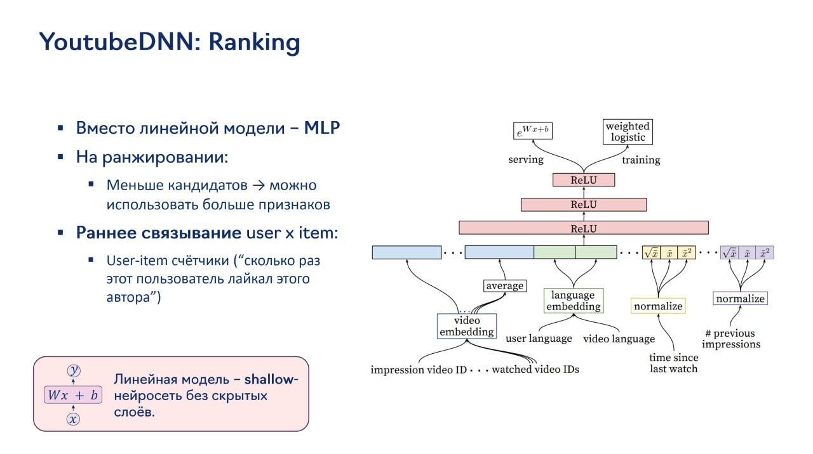

# Image Description

**File:** img_1764244291_aqadlgxrg8dukel_youtubednn_ranking.jpg
**Original:** image.jpg
**Received:** 1764244291

## Extracted Text (OCR)

## YoutubeDNN: Ranking

- = Вместо линейной модели - MLP
- " Ha ранжировании:
- " Меньше кандидатов &gt; можно использовать больше признаков
- =» Раннее связывание user x item:
- " User-item счётчики ("сколько раз этот пользователь лаийкал этого автора}

<!-- image -->

<!-- image -->

## Usage Instructions

When referencing this image in markdown:
1. Use relative path based on file location
2. Add descriptive alt text based on OCR content above
3. Add text description BELOW the image for GitHub rendering

Example:
```markdown
 <!-- TODO: Broken image path -->

**Image shows:** [Describe what the image contains based on OCR]
```
