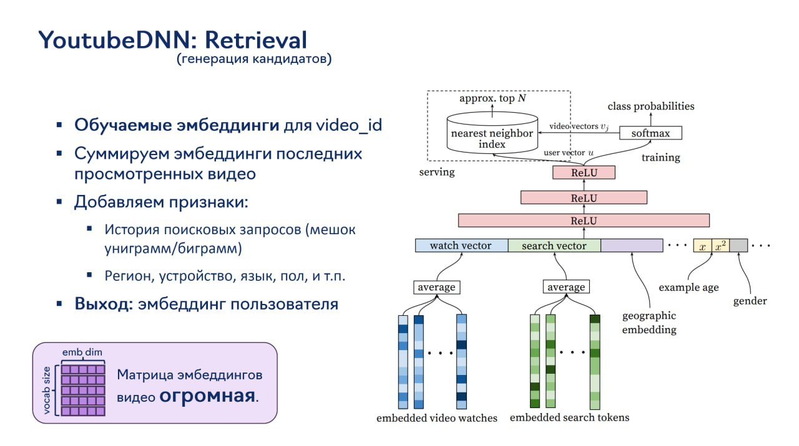

# Image Description

**File:** img_1764244291_aqadlqxrg8dukel_youtubednn_retrieval.jpg
**Original:** image.jpg
**Received:** 1764244291

## Extracted Text (OCR)

## YoutubeDNN: Retrieval

(генерация кандидатов)

- = Обучаемые эмбеддинги для video id
- = Суммируем эмбеддинги последних чи просмотренных видео serving
- ‚ Добавляем признаки:
- и История поисковых запросов (мешок униграмм/биграмм} | watch vector | search vector
- " Регион, устроиство, язык, NOM, ит.п.
- = Выход: эмбеддинг пользователя

— Ss Ш

m= Чы

SB SSB Seer es

embedded video watches

embedded search tokens

<!-- image -->

<!-- image -->

## Usage Instructions

When referencing this image in markdown:
1. Use relative path based on file location
2. Add descriptive alt text based on OCR content above
3. Add text description BELOW the image for GitHub rendering

Example:
```markdown
 <!-- TODO: Broken image path -->

**Image shows:** [Describe what the image contains based on OCR]
```
