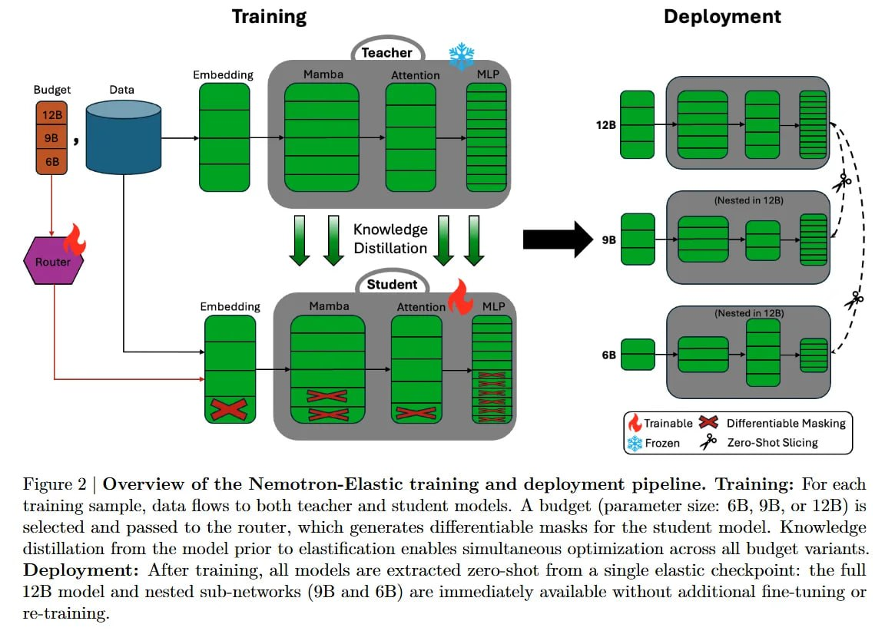

# Image Description

**File:** img_1764253669_aqadrbfrgwvaoul_figure_2_overview_of_the.jpg
**Original:** image.jpg
**Received:** 1764253669

## Extracted Text (OCR)

Figure 2 | Overview of the Nemotron-Elastic training and deployment pipeline. Training: For each training sample, data flows to both teacher and student models. A budget (parameter size: 6B, 9B, or 12B) is selected and passed to the router, which generates differentiable masks for the student model. Knowledge distillation trom the model prior to elastincation enables simultaneous optimization across all budget variants. Deployment: After training, all models are extracted zero-shot from a single elastic checkpoint: the full 12B model and nested sub-networks (ЭВ and 6B) are immediately available without additional fine-tuning or re-traimineg.

<!-- image -->

## Usage Instructions

When referencing this image in markdown:
1. Use relative path based on file location
2. Add descriptive alt text based on OCR content above
3. Add text description BELOW the image for GitHub rendering

Example:
```markdown
 <!-- TODO: Broken image path -->

**Image shows:** [Describe what the image contains based on OCR]
```
