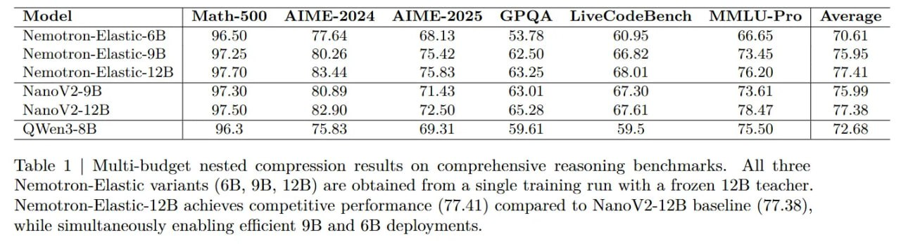

# Image Description

**File:** img_1764253669_aqadrhfrgwvaoul_model_math_500_aime_2024.jpg
**Original:** image.jpg
**Received:** 1764253669

## Extracted Text (OCR)

|                                                                      | Model | Math-500 AIME-2024 AIME-2025 GPQA _ LiveCodeBench MMLU-Pro | Average   |
|----------------------------------------------------------------------|--------------------------------------------------------------------------------|
| Nemotron-Flastic-6B | 96.50 т БА 68.13 52 7R 60.95 66.65 | =" 6]     |                                                                                |
| Nemotron-Elastic-9B | 97.25 80.26 1542 62.50 66.82 734.45 | 65.95    |                                                                                |
| Nemotron-Elastic-12B | 97.70) 83.44 75.83 63.25 68.01 76.20) | 7 Al] |                                                                                |
| Nano V 2-9B | 97.30 $0. “9 (1.43 63.01 6/30) (3.6L | 7.99            |                                                                                |
| ()Wen3-8B 96.3 75.83 69.31 59.61 59.5 79.90 | 72.68                  |                                                                                |

Table 1 | Multi-budget nested compression results on comprehensive reasoning benchmarks. АШ three Nemotron-Elastic variants (6B, 9B, 12B) are obtained from a single training run with a frozen 12B teacher. Nemotron-Elastic-12B achieves competitive performance (77.41) compared to NanoV2-12B baseline (77.38). while simultaneously enabling efhcient 9B and 6B deployments.

## Usage Instructions

When referencing this image in markdown:
1. Use relative path based on file location
2. Add descriptive alt text based on OCR content above
3. Add text description BELOW the image for GitHub rendering

Example:
```markdown
 <!-- TODO: Broken image path -->

**Image shows:** [Describe what the image contains based on OCR]
```
