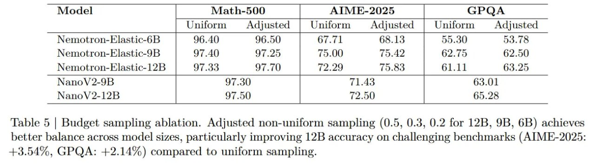

# Image Description

**File:** img_1764253669_aqadrxfrgwvaoul_model_math_500_aime_2025.jpg
**Original:** image.jpg
**Received:** 1764253669

## Extracted Text (OCR)

|                                                             | Model Math-500 AIME-2025 СРОА   | Model Math-500 AIME-2025 СРОА                          |
|-------------------------------------------------------------|---------------------------------|--------------------------------------------------------|
|                                                             |                                 | Uniform Adjusted | Uniform Adjusted | Uniform Adjusted |
| Nemotron-Piastic-4B | 06.40 9650 | 67.71 6813 | 55.30 53 7Я |                                 |                                                        |
| Nemotron-Elastic-9B | 940 97.95 1 75.00 75.49 | 62.75 62.50 |                                 |                                                        |
| Nemotron-Blastic-12B                                        |                                 |                                                        |
|                                                             | Nano V 2-OB                     | Nano V 2-OB                                            |
| 97 50                                                       |                                 |                                                        |

Table 5 | Budget sampling ablation. Adjusted non-uniform sampling (0.5, 0.3, 0.2 for 12B, 9B, 6B) achieves better balance across model sizes, particularly improving 12B accuracy on challenging benchmarks (AIME-2025: +3.54%, GPQA: +2.14%) compared to uniform sampling.

## Usage Instructions

When referencing this image in markdown:
1. Use relative path based on file location
2. Add descriptive alt text based on OCR content above
3. Add text description BELOW the image for GitHub rendering

Example:
```markdown
 <!-- TODO: Broken image path -->

**Image shows:** [Describe what the image contains based on OCR]
```
