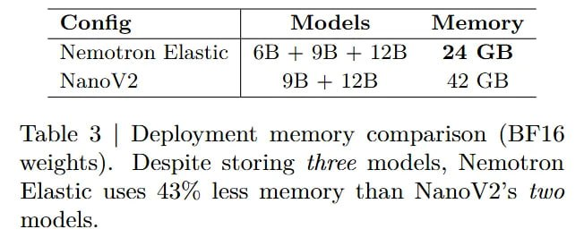

# Image Description

**File:** img_1764253669_aqadsbfrgwvaoul9_on_models_emor_config.jpg
**Original:** image.jpg
**Received:** 1764253669

## Extracted Text (OCR)

| on Models emor Config | Model М у      |
|----------------------------------------|
| Nemotron Elastic | 6B + 9B + 12B 24 GB |
| NanoV? | 9В + 12В A? GB                |

Table 3 | Deployment memory comparison (BF 16 weights). Despite storing three models, Nemotron Elastic uses 43% less memory than NanoV2's two models.

## Usage Instructions

When referencing this image in markdown:
1. Use relative path based on file location
2. Add descriptive alt text based on OCR content above
3. Add text description BELOW the image for GitHub rendering

Example:
```markdown
 <!-- TODO: Broken image path -->

**Image shows:** [Describe what the image contains based on OCR]
```
