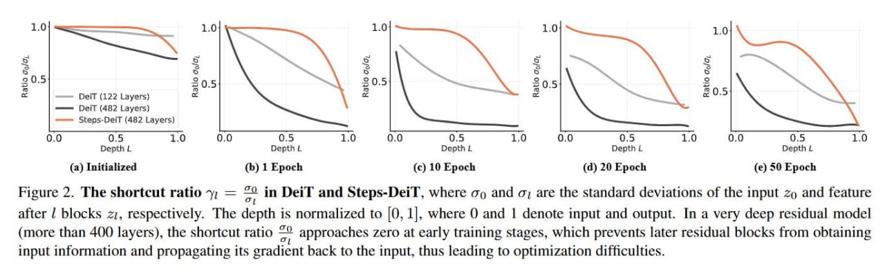

# Image Description

**File:** img_1764253717_aqadiq1rgr9qul_figure_2_the_shortcut_ratio_7.jpg
**Original:** image.jpg
**Received:** 1764253717

## Extracted Text (OCR)

Figure 2. The shortcut ratio 7, = — in рат and Steps-DeiT, where оо and от are the standard deviations of the input zp and feature

oa; after | blocks 21, respectively. The depth is normalized to |0, 1], where 0 and | denote input and output. In a very deep residual model (more than 400 layers), the shortcut ratio aE approaches zero at early training stages, which prevents later residual blocks from obtaining input information and propagating its gradient back to the input, thus leading to optimization difficulties.

<!-- image -->

## Usage Instructions

When referencing this image in markdown:
1. Use relative path based on file location
2. Add descriptive alt text based on OCR content above
3. Add text description BELOW the image for GitHub rendering

Example:
```markdown
 <!-- TODO: Broken image path -->

**Image shows:** [Describe what the image contains based on OCR]
```
