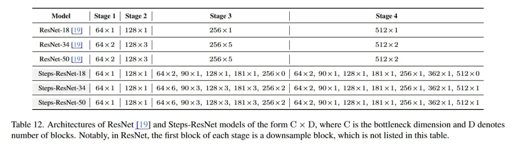

# Image Description

**File:** img_1764253717_aqadjg1rgr9qul_model_stage_1.jpg
**Original:** image.jpg
**Received:** 1764253717

## Extracted Text (OCR)

|                                            | Model Stage 1 | Stage 2 Stage 3 Stage 4                                                                         |
|--------------------------------------------|-----------------------------------------------------------------------------------------------------------------|
| ResNet-18 [19] | 64x1 | 128x1 256х1 512x1  |                                                                                                                 |
| ResNet-34 [19] | 64x2 | 128x3 256 x5 512x2 |                                                                                                                 |
| ResNet-50 [19] | 64х2 128 x3 256 *5 512x2  |                                                                                                                 |
|                                            | Steps-ResNet-18 | 64x1 | 128x1 | 64х2, 90x1, 128x1, 181x1, 256x0 | 64х2, 90x1, 128x1, 1811, 256x1, 362х1, 512x0 |
| Steps-ResNet-34                            | 64x1 | 128х1 o4x6, $US, LZ45x%5, 161% 3, Z00X% 2 4х2, 90x11, 1281, 181x1, 2561, d62x1, 512x1                    |
| Steps-ResNet-50                            | 64x1 | 128x1 1х6. Эхо, LZBx3S, L6alLx3, Zoo x 2 b4x24. 9Ux1, 1461, 18lLxl, 226х1, db2xk 1, olZx 1               |

Table 12. Architectures of ResNet [19] and Steps-ResNet models of the form С x D, where C 1$ the bottleneck dimension and D denotes number of blocks. Notably, in ResNet, the first block of each stage is a downsample block, which 15 not listed in this table.

## Usage Instructions

When referencing this image in markdown:
1. Use relative path based on file location
2. Add descriptive alt text based on OCR content above
3. Add text description BELOW the image for GitHub rendering

Example:
```markdown
 <!-- TODO: Broken image path -->

**Image shows:** [Describe what the image contains based on OCR]
```
