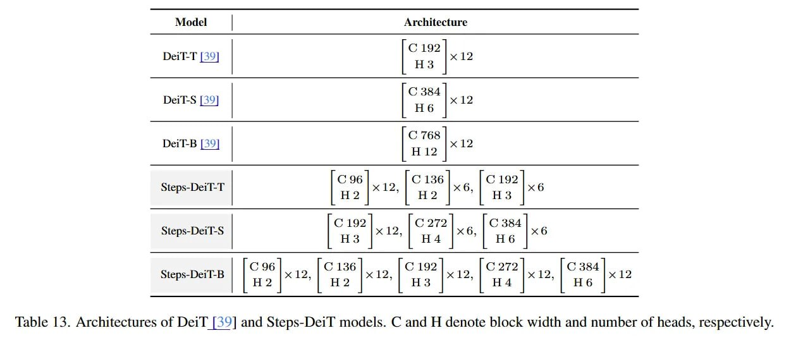

# Image Description

**File:** img_1764253717_aqadjw1rgr9qul_lable_13_architectures_of_deil_213.jpg
**Original:** image.jpg
**Received:** 1764253717

## Extracted Text (OCR)

lable 13. Architectures of Deil |213] and Steps-Deil models. С and H denote block width and number of heads, respectively.

| Model | Architecture                                                                                          | Model | Architecture                                                                                                    | Model | Architecture                                                                                          | Model | Architecture                             | Model | Architecture                             | Model | Architecture                             | Model | Architecture   | Model | Architecture   | Model | Architecture   | Model | Architecture   | Model | Architecture   | Model | Architecture   |
|---------------------------------------------------------------------------------------------------------------|-------------------------------------------------------------------------------------------------------------------------|---------------------------------------------------------------------------------------------------------------|--------------------------------------------------|--------------------------------------------------|--------------------------------------------------|------------------------|------------------------|------------------------|------------------------|------------------------|------------------------|
| ({, 192 Der i-T [34]                                                                                          | ({, 192 Der i-T [34]                                                                                                    | ({, 192 Der i-T [34]                                                                                          | ({, 192 Der i-T [34]                             | ({, 192 Der i-T [34]                             | ({, 192 Der i-T [34]                             |                        |                        |                        |                        |                        |                        |
| DeiT-S [39] с 384 |  x12                                                                                      | DeiT-S [39] с 384 |  x12                                                                                                | DeiT-S [39] с 384 |  x12                                                                                      | DeiT-S [39] с 384 |  x12                         | DeiT-S [39] с 384 |  x12                         | DeiT-S [39] с 384 |  x12                         |                        |                        |                        |                        |                        |                        |
| 1 C 76 Derl-B 139] С 768. х  "ГВ [39 ГВ [35] H12                                                              | 1 C 76 Derl-B 139] С 768. х  "ГВ [39 ГВ [35] H12                                                                        | 1 C 76 Derl-B 139] С 768. х  "ГВ [39 ГВ [35] H12                                                              | 1 C 76 Derl-B 139] С 768. х  "ГВ [39 ГВ [35] H12 | 1 C 76 Derl-B 139] С 768. х  "ГВ [39 ГВ [35] H12 | 1 C 76 Derl-B 139] С 768. х  "ГВ [39 ГВ [35] H12 |                        |                        |                        |                        |                        |                        |
| “tens-Derl_-T  М] |                                                                                           | “tens-Derl_-T  М] |                                                                                                     | “tens-Derl_-T  М] |                                                                                           |                                                  |                                                  |                                                  |                        |                        |                        |                        |                        |                        |
| 1¢, 192 |]  |; 272 |  1,354 fens-lL)e1i-s | ., С 192 «= | C272 ‚ |C3a4 ’ Steps-DeiT-S | НЗ [к | HA |xo, HG |e | 1¢, 192 |]  |; 272 |  1,354 fens-lL)e1i-s | ., С 192 «= | C272 ‚ |C3a4 ’ Steps-DeiT-S | НЗ [к | HA |xo, HG |e           | 1¢, 192 |]  |; 272 |  1,354 fens-lL)e1i-s | ., С 192 «= | C272 ‚ |C3a4 ’ Steps-DeiT-S | НЗ [к | HA |xo, HG |e |                                                  |                                                  |                                                  |                        |                        |                        |                        |                        |                        |
|                                                                                                               | cogl |cai136!|  1|С192|  £scace272!| —§ |a3R4 ет ет ыы мт eps-DeiT-B  С 96 H2  C 136 H2  C192 С 272 x12 x12 x 12  C 384 |                                                                                                               |                                                  |                                                  |                                                  |                        |                        |                        |                        |                        |                        |

## Usage Instructions

When referencing this image in markdown:
1. Use relative path based on file location
2. Add descriptive alt text based on OCR content above
3. Add text description BELOW the image for GitHub rendering

Example:
```markdown
 <!-- TODO: Broken image path -->

**Image shows:** [Describe what the image contains based on OCR]
```
