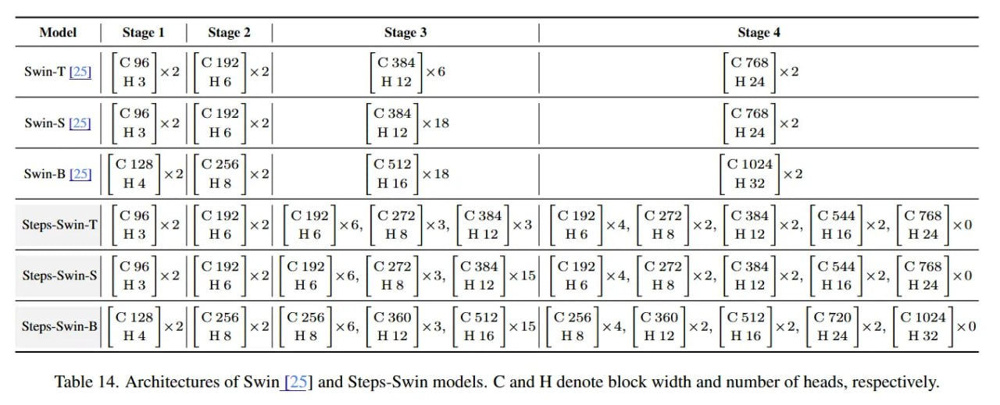

# Image Description

**File:** img_1764253717_aqadka1rgr9qul_14_architectures_of_swin.jpg
**Original:** image.jpg
**Received:** 1764253717

## Extracted Text (OCR)

Та 14. Architectures of Swin | 25] and Steps-Swin models. С and H denote block width and number of heads, respectively.

|                                                                                                                                                                                                                                                                   |                                                                               | Model Stagel | Stage2 | Stage 3 Stage 4   | Model Stagel | Stage2 | Stage 3 Stage 4                                                        | Model Stagel | Stage2 | Stage 3 Stage 4                                                                                                                          | Model Stagel | Stage2 | Stage 3 Stage 4   | Model Stagel | Stage2 | Stage 3 Stage 4   | Model Stagel | Stage2 | Stage 3 Stage 4   | Model Stagel | Stage2 | Stage 3 Stage 4   | Model Stagel | Stage2 | Stage 3 Stage 4   | Model Stagel | Stage2 | Stage 3 Stage 4   | Model Stagel | Stage2 | Stage 3 Stage 4   | Model Stagel | Stage2 | Stage 3 Stage 4   |
|-------------------------------------------------------------------------------------------------------------------------------------------------------------------------------------------------------------------------------------------------------------------|-------------------------------------------------------------------------------|-------------------------------------------|------------------------------------------------------------------------------------------------|------------------------------------------------------------------------------------------------------------------------------------------------------------------|-------------------------------------------|-------------------------------------------|-------------------------------------------|-------------------------------------------|-------------------------------------------|-------------------------------------------|-------------------------------------------|-------------------------------------------|
|                                                                                                                                                                                                                                                                   | Swin-F 1257 | 1278 1xa || 42" 1x al | С 384 | в | |С 768 |2 ЕН 12 |           |                                           |                                                                                                |                                                                                                                                                                  |                                           |                                           |                                           |                                           |                                           |                                           |                                           |                                           |
|                                                                                                                                                                                                                                                                   | cogl |leig2] | 1c 34 | | ТС 768 Iwill C 96 Swin-S [25 win es | H3  C 768 H 24 |                                           |                                                                                                |                                                                                                                                                                  |                                           |                                           |                                           |                                           |                                           |                                           |                                           |                                           |
|                                                                                                                                                                                                                                                                   |                                                                               |                                           | фл. ]  ТЖ, 2S6 |  1c. 1284                                                                     |                                                                                                                                                                  |                                           |                                           |                                           |                                           |                                           |                                           |                                           |                                           |
| 1 1C96| ._/1C192/] .| 1C192|] . |C272| . |C3sa4] _| |C192| . |C272| . |C3as4|] . |C544!] . | C768) Steps-Swin-T  C 96 Fal  C 192 in H6  С 192 we C 272 3 С 384 x3 H6 '| НЗ “? | Big |"  [С 192 а С 272 sy C 384 2 С 544 “an C 768 wn H6 "| HB i) Hw "| H16 *| H24 |                                                                               |                                           |                                                                                                |                                                                                                                                                                  |                                           |                                           |                                           |                                           |                                           |                                           |                                           |                                           |
| | 1296| _||1С192| _||c192| . |c272!| . |c3s4] _.|]c192] . |c272!| . |cs3s4| . |cs44| _ |c 768  —                                                                                                                                                                  |                                                                               |                                           |                                                                                                | Steps-Swin-S х2  С; 96 НЗ  C 192 2 H6  C192] 5 C272]. C384]. H6 "| НВ | "| Hie `  [С 192], C272], | С384 |. С 544 хо |6 768 | | нб |^ "| HS "Г н12 | W416 "| Н24 |                                           |                                           |                                           |                                           |                                           |                                           |                                           |                                           |
|                                                                                                                                                                                                                                                                   |                                                                               |                                           | _11C128!| _||c256| .||c256| . |Cc360| . |C512] ._|| C256] . |}c360| . |C512] . |c720| . |C1024 | C 360  2 х H 12  Steps-Swin-B x 4,  C 128 Н4  C 256 “2 H8  c256] . |c360] . | С512 кв, | аз  C 256 НЗ  2 C512 “2 C 720 “2 C 1024 x0 | H16 "| {24 "| Bz           |                                           |                                           |                                           |                                           |                                           |                                           |                                           |                                           |

## Usage Instructions

When referencing this image in markdown:
1. Use relative path based on file location
2. Add descriptive alt text based on OCR content above
3. Add text description BELOW the image for GitHub rendering

Example:
```markdown
 <!-- TODO: Broken image path -->

**Image shows:** [Describe what the image contains based on OCR]
```
