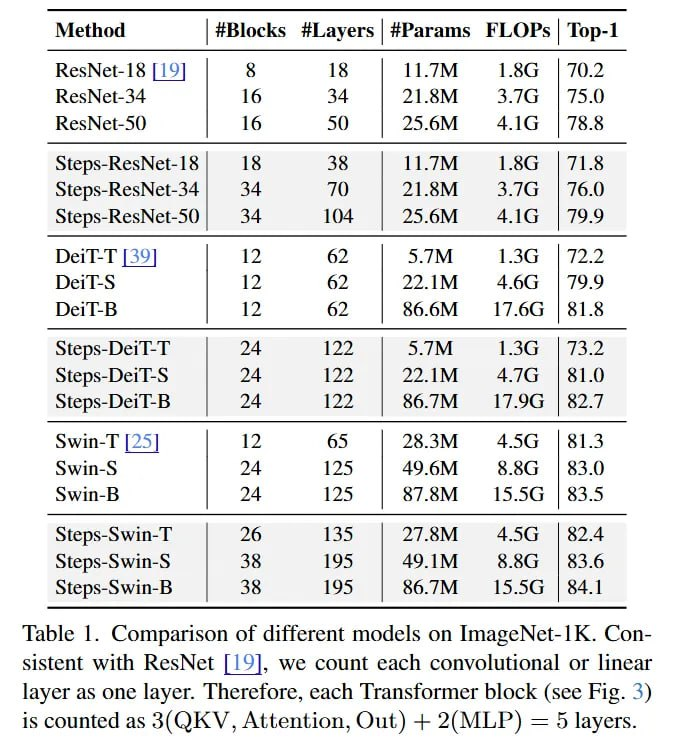

# Image Description

**File:** img_1764253717_aqadkq1rgr9qul9_lable_comparison_of_different_models.jpg
**Original:** image.jpg
**Received:** 1764253717

## Extracted Text (OCR)

lable |. Comparison of different models on ImageNet-IK. Consistent with KesNet |/19], we count each convolutional or linear layer as one layer. [herefore, each lransformer block (see Fig. 3) is counted as 3(QKV, Attention, Out) + 2(МЕР) = 5 layers.

|                                                   | Method | #Blocks #Layers | #Params FLOPs | Тор-1   |
|---------------------------------------------------|----------------------------------------------------|
| ResNet-I8 [19] | 8 18 | ПРМ 18 | 70.2             |                                                    |
| 16  3A  DY] SM  3 7:  | 7% 0                      |                                                    |
| Kes Ме 9}                                         |                                                    |
| steps-KesNet-16) 15 36 | IL/M 150 | /1.6          |                                                    |
| Steps-ResNet-34|) 34 70. | 21.8M——3..7G_s |: 76.0 |                                                    |
| Steps-ResNet-50| 34 104 | 256M 4.1G | 79.9        |                                                    |
| Dei1T-T [39] #$| £12 62 | S.JM 21.36 1722         |                                                    |
|                                                   | DeiT-S |; 42 62) #=| 329. 1M А 6: | 799            |
|                                                   | 1?                                                 |
| steps-De1l-T | 24 If | ЗМ 1.5G 115.4              |                                                    |
| Steps-De1T-S | 24 122 | 221M 4.7G | 81.0          |                                                    |
| Steps-De1T-B | 24 122 | 86.7М — 17.9G | 82.7      |                                                    |
| Swin-T [25] | 12 65 | 28.3M 4.5G | 81.3           |                                                    |
|                                                   | Swin-S  A  135  AQ 6M  Я ВС:  183.0)               |
|                                                   | Swin-bh                                            |
| Ssteps-Swin-T | 26 1855 | 27.8M 4.5G | 82.4       |                                                    |
| Steps-Swin-S | 38 195 | 49. 1IM 8.8G | 83.6       |                                                    |
| Steps-Swin-B | 38 195 | 86.7M 15.59 | 84.1        |                                                    |

## Usage Instructions

When referencing this image in markdown:
1. Use relative path based on file location
2. Add descriptive alt text based on OCR content above
3. Add text description BELOW the image for GitHub rendering

Example:
```markdown
 <!-- TODO: Broken image path -->

**Image shows:** [Describe what the image contains based on OCR]
```
