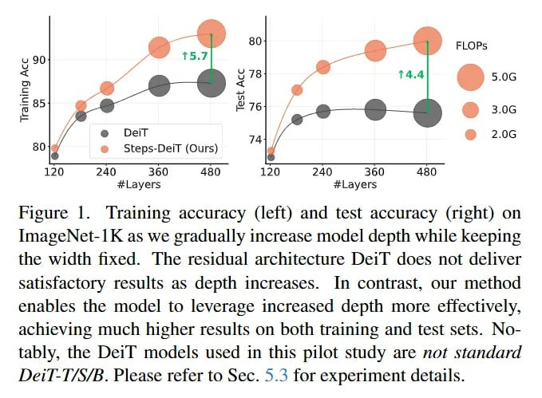

# Image Description

**File:** img_1764253718_aqadkw1rgr9qul9_figure_raining_accuracy_left_and.jpg
**Original:** image.jpg
**Received:** 1764253718

## Extracted Text (OCR)

Figure |. [raining accuracy (left) and test accuracy (right) on imageNet-IK as we gradually increase model depth while keeping the width fixed. [he residual architecture WDerl does not deliver Satisfactory results as depth increases. In contrast, our method enables the model to leverage increased depth more effectively. achieving much higher results on both training and test sets. Notably, the Deil models used in this pilot study are not standard Detl-1/S/B. Please refer to Sec. 5.5 for experiment detatls.

<!-- image -->

## Usage Instructions

When referencing this image in markdown:
1. Use relative path based on file location
2. Add descriptive alt text based on OCR content above
3. Add text description BELOW the image for GitHub rendering

Example:
```markdown
 <!-- TODO: Broken image path -->

**Image shows:** [Describe what the image contains based on OCR]
```
