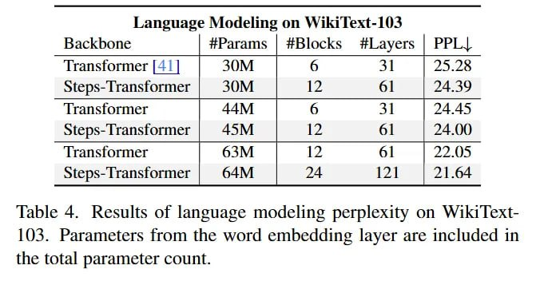

# Image Description

**File:** img_1764253718_aqadla1rgr9qul9_lable_4_kesults_of_language_modeling.jpg
**Original:** image.jpg
**Received:** 1764253718

## Extracted Text (OCR)

lable 4. Kesults of language modeling perplexity on Wiki lext103. Parameters from the word embedding layer are included in the total parameter count.

| Language Modeling on Wiki lext-103           | Language Modeling on Wiki lext-103   | Language Modeling on Wiki lext-103   | Language Modeling on Wiki lext-103   | Language Modeling on Wiki lext-103   |
|----------------------------------------------|--------------------------------------|--------------------------------------|--------------------------------------|--------------------------------------|
| Backbone | #Params | #Blocks #lLayers | PPL| |                                      |                                      |                                      |                                      |
| Transformer [41] | 30M | 6 31 | 25.28        |                                      |                                      |                                      |                                      |
| Steps-Transformer | 30M | = 12 61 | 24.39    |                                      |                                      |                                      |                                      |
| Transformer 44M | 6 31 24.45                 |                                      |                                      |                                      |                                      |
| Steps-Transformer | 45M | = 12 61 | 24.00    |                                      |                                      |                                      |                                      |
| Transformer 63M 12 61 22.05                  |                                      |                                      |                                      |                                      |
| Steps-Transformer | 64M | 24 121 | 21.64     |                                      |                                      |                                      |                                      |

## Usage Instructions

When referencing this image in markdown:
1. Use relative path based on file location
2. Add descriptive alt text based on OCR content above
3. Add text description BELOW the image for GitHub rendering

Example:
```markdown
 <!-- TODO: Broken image path -->

**Image shows:** [Describe what the image contains based on OCR]
```
