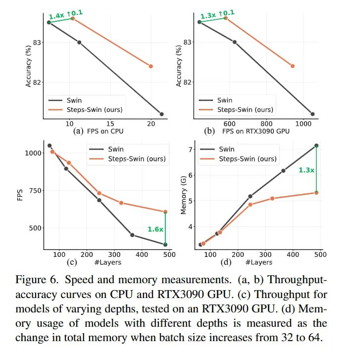

# Image Description

**File:** img_1764253718_aqadlq1rgr9qul9_rigure_6_speed_and_memory_measurements.jpg
**Original:** image.jpg
**Received:** 1764253718

## Extracted Text (OCR)

rigure 6. Speed and memory measurements. (a, b) [hroughputaccuracy curves on CPU and RI AS35090 GPU. (&lt;) Throughput for models of varying depths, tested on an KI AS35090 GPU. (а) Memory usage of models with different depths 1s measured as the change in total memory when batch size increases from 32 to 64.

<!-- image -->

## Usage Instructions

When referencing this image in markdown:
1. Use relative path based on file location
2. Add descriptive alt text based on OCR content above
3. Add text description BELOW the image for GitHub rendering

Example:
```markdown
 <!-- TODO: Broken image path -->

**Image shows:** [Describe what the image contains based on OCR]
```
