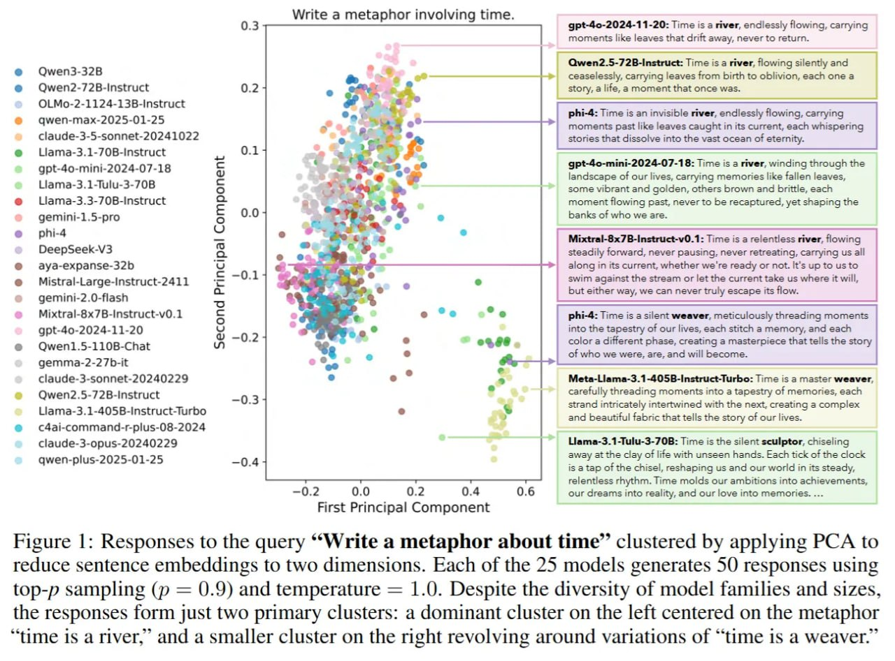

# Image Description

**File:** img_1764342532_aqadhxjrgr9qul_figure_1_responses_to_the_query.jpg
**Original:** image.jpg
**Received:** 1764342532

## Extracted Text (OCR)

Figure 1: Responses to the query **Write a metaphor about time" clustered by applying PCA to reduce sentence embeddings to two dimensions. Each of the 25 models generates 50 responses using top-p sampling (p = 0.9) and temperature = 1.0. Despite the diversity of model families and sizes, the responses form just two primary clusters: a dominant cluster on the left centered on the metaphor "time 1$ a river,' and a smaller cluster on the right revolving around variations of "time 1$ a weaver."

<!-- image -->

## Usage Instructions

When referencing this image in markdown:
1. Use relative path based on file location
2. Add descriptive alt text based on OCR content above
3. Add text description BELOW the image for GitHub rendering

Example:
```markdown
 <!-- TODO: Broken image path -->

**Image shows:** [Describe what the image contains based on OCR]
```
