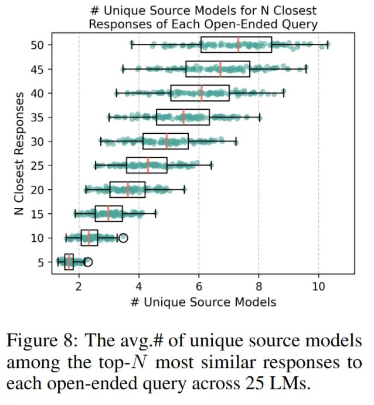

# Image Description

**File:** img_1764342532_aqadibjrgr9qul9_figure_8_the_avg_of_unique.jpg
**Original:** image.jpg
**Received:** 1764342532

## Extracted Text (OCR)

Figure 8: The avg.# of unique source models among the top-/V most similar responses to each open-ended query across 25 LMs.

<!-- image -->

## Usage Instructions

When referencing this image in markdown:
1. Use relative path based on file location
2. Add descriptive alt text based on OCR content above
3. Add text description BELOW the image for GitHub rendering

Example:
```markdown
 <!-- TODO: Broken image path -->

**Image shows:** [Describe what the image contains based on OCR]
```
