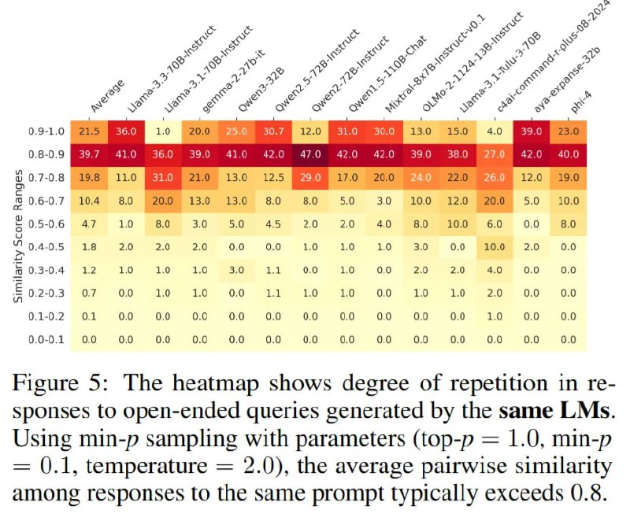

# Image Description

**File:** img_1764342532_aqadihjrgr9qul9_figure_5_the_heatmap_shows_degree.jpg
**Original:** image.jpg
**Received:** 1764342532

## Extracted Text (OCR)

Figure 5: The heatmap shows degree of repetition in responses to open-ended queries generated by the same LMs. Using min-p sampling with parameters (top-p = 1.0, min-p = ().1, temperature = 2.0), the average pairwise similarity among responses to the same prompt typically exceeds 0.8.

<!-- image -->

## Usage Instructions

When referencing this image in markdown:
1. Use relative path based on file location
2. Add descriptive alt text based on OCR content above
3. Add text description BELOW the image for GitHub rendering

Example:
```markdown
 <!-- TODO: Broken image path -->

**Image shows:** [Describe what the image contains based on OCR]
```
